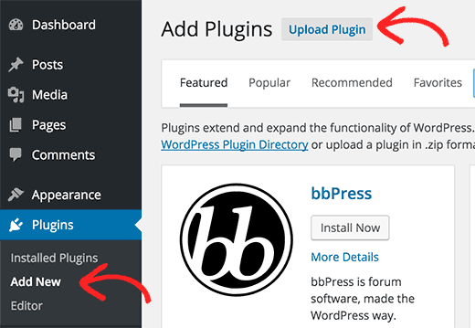
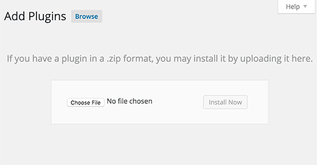

SeLCont
=======

Synchronized eLearning Content Toolkit

For a SeLCont ten-minute demo lecture (Introduction to SeLCont) click <a href="http://webvm.netmode.ntua.gr/courses/?lectures=introduction-to-selcont-english" target="_blank">here</a>

The final course page consists of these elements: 
<ul>
<li>An area that renders the slides. "Slides" is the result from the presentation file (ppt) and the notes from instructor's tablet during the course</li>
<li>An area that renders the video. Video is the export file from the camera inside the auditorium</li>
<li>An area with the headers/annotations of the course</li>
</ul>

Functionality
=============
The resources of the page will be the presentation file (ppt), the notes from instructor's tablet and the video from the auditorium. The final course page will be developed with HTML5, CSS3, Javascript technologies in order to be responsive and viewable from any device.

Post-processing Procedure
===================
When the resources will be available and in the right format/shape the administrator has to create a new Course (with a title and a date required) and upload the material for synchronization.  

License
========
This software is licensed under the GNU GENERAL PUBLIC LICENSE. For more information, read the file <a href="LICENSE">LICENSE</a>.

Installation
============

SeLCont is implemented as a WordPress Plugin. This plugin is compatible with both single and multisite instances of WordPress. Admininstators are encouraged to setup a WordPress Network (multisite) if they want to integrate SeLCont with a LMS via LTI. Further instructions for setting up a WordPress multisite instance can be found <a href="https://wordpress.org/support/article/create-a-network/" target="_blank">here</a>. Another option is to use a docker image of a WordPress multisite instance. More instructions regarding the deployment of the docker container can be found <a href="https://hub.docker.com/_/wordpress/" target="_blank">here</a>.

<u>Plugin Requirements</u>
<ul>
<li> WordPress version 5.x (It is tested up to 5.3 version) </li>
<li> PHP 7.3 is required </li>
</ul>

SeLCont WordPress Plugin can be found <a href="https://github.com/up2university/selcont/blob/master/selcont.zip" target="_blank">here</a>

<u>Plugin Installation</u>

The procedure is quite simple. First, you need to download the plugin from the source (which will be a zip file). Next, you need to go to WordPress admin area and visit Plugins » Add New, page.

After that, click on the Upload Plugin button on top of the page.

This will bring you to the plugin upload page. Here you need to click on the choose file button and select the plugin file you downloaded earlier to your computer.

After you have selected the file, you need to click on the install now button.

WordPress will now upload the plugin file from your computer and install it for you. You will see a success message like this after the installation is finished.

Once installed, you need to click on the Activate Plugin link to start using the plugin.

<u>Integration with a LMS</u>

The integration between SeLCont and an LMS is based in Learning Tools Interoperability (LTI) standard, developed by the IMS Global Learning Consortium. A WordPress Multisite is required for the integration. 

How to use it
=============

Introduction to SeLCont can be found <a href="https://webvm.netmode.ntua.gr/courses/?lectures=introduction-to-selcont-english" target="_blank">here</a>

A short tutorial for SeLCont can be found <a href="https://www.youtube.com/watch?v=OxSCkSrX8bI" target="_blank">here</a>

A brief SeLCont Guide can be found <a href="https://drive.man.poznan.pl/s/N6nH29LrqCpkBig#pdfviewer" target="_blank">here</a> (Check the section for SeLCont).
